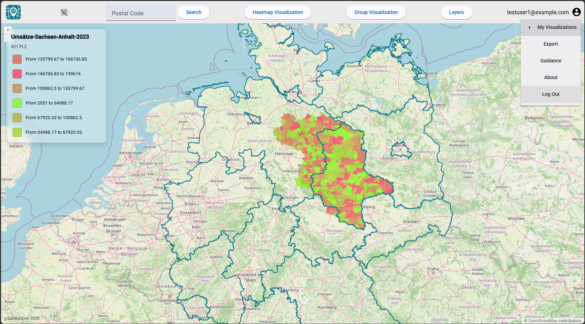

# PLZ5 Visualizer

Interactive GIS web application for visualizing German postal code (PLZ5) data.

Users can upload CSV files containing postal codes and values and visualize them as heatmaps or grouped thematic maps. Visualizations are stored per user and can be reloaded at any time.

## Features


- CSV import for postcode based datasets
- Interactive OpenLayers map
- Heatmap visualizations
- Group based visualizations
- Single legend group postal area map selection
- Pdf Export
- Toggle layers on and off
- User authentication
- User specific saved visualizations
- Persistent storage using PostgreSQL/PostGIS
- Interactive postcode selection


## Technologies

Frontend
- Angular 19
- Angular Material
- NgRx
- RxJS
- OpenLayers

Backend
- ASP.NET Core Web API (.NET 10)
- Entity Framework Core
- AutoMapper
- ASP.NET Identity
- JWT Authentication

Database
- PostgreSQL
- PostGIS

Infrastructure
- Docker
- Nginx


## Authentication

The application uses:

- ASP.NET Identity
- JWT Authentication
- Protected API endpoints
- User specific visualizations

Only authenticated users can create, store and manage visualizations.


## Architecture

Angular + OpenLayers
        |
        v
ASP.NET Core Web API
        |
        v
PostgreSQL + PostGIS


## Running with Docker

Services:
- Frontend (Angular + Nginx)
- Backend (ASP.NET Core API)
- PostgreSQL/PostGIS

```bash
docker compose up --build
```

## Screenshots




## Setup

Requirements:
- Node.js
- .NET 8
- Docker
